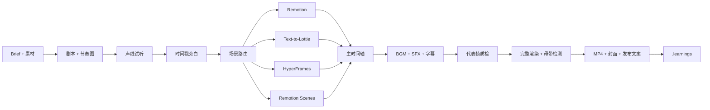

# Agentic Video Foundry ⚡️

> 把一句创意，锻造成一条真正能发布的短视频。

[](#安装)
[](LICENSE)
[](#智能场景路由)
[](#声音不是附属品)

**Agentic Video Foundry**（智能视频铸造厂）是一套面向 coding agents 的全流程短视频生产 Skill。它不会在“脚本写完了”或“渲染命令成功了”时提前宣布完成，而是把创意、分镜、配音、音乐、音效、字幕、动效、混音、渲染、视听质检和交付串成一条可复现的生产线。

适用于小红书、抖音、TikTok、Reels、Shorts、产品发布、知识分享、教程、数据短片和可批量复用的品牌栏目。

## 为什么是 Agentic Video Foundry

- **成片负责制**：终点是看过、听过、测过的发布文件，不是中间产物。
- **声音驱动时间轴**：真实旁白时间戳生成场景与字幕，拒绝估算和机械加速。
- **双音频后端**：ElevenLabs 与火山豆包语音可按旁白、音乐、音效分别选择，工程层不绑定供应商。
- **真实 Demo 优先**：工具介绍片用真实界面、命令和输出证明能力，动效只负责聚焦与解释。
- **智能场景路由**：Remotion、Text-to-Lottie、HyperFrames 和 Remotion Scenes 各做擅长的事。
- **渐进式风格模块**：主 Skill 只做风格选择，选中后才加载具体材质、排版、运动语法和硬失败项。
- **可听见的音乐**：BGM 在手机外放上有存在感，同时不遮住人声。
- **可复现与可审计**：固定依赖、素材哈希、无密钥 manifest、确定性逐帧动画。
- **质量硬闸门**：代表帧、平台安全区、完整视听、LUFS、dBTP、编码参数一个都不少。
- **经验会进化**：偶发问题先进入 `.learnings/`，重复验证后再晋升为规则或 Skill。

## 一条真正闭环的生产线



## 智能场景路由

| 能力 | 最适合 | Foundry 中的角色 |
|---|---|---|
| **Remotion** | 多场景、React、数据模板、旁白/字幕精确同步 | 默认主合成器 |
| **Text-to-Lottie** | Logo、图标、流程、KPI、微交互、透明矢量循环 | 可选资产支线，先 Skottie 后最终渲染器双验收 |
| **HyperFrames** | HTML/CSS/GSAP、网页素材、动态图表、DOM 动效 | 可选场景或项目后端 |
| **Remotion Scenes** | 快速复用 React/TSX 动效场景 | 按项目固定版本并 vendoring，不冒充 Skill |

Agentic Video Foundry 不鼓励“为了技术栈全家桶而混用”。每个镜头先做需求路由，最终由一个主时间轴收口。

## 可扩展风格模块

风格不是一组散乱滤镜，而是材质、配色、排版、证据处理、运动语法、转场和失败条件的完整契约。Foundry 使用渐进式披露：先读取[风格路由](skills/agentic-video-foundry/references/style-routing.md)，选中后才加载具体模块。

内置模块包括：

- [手撕纸拼贴定格](skills/agentic-video-foundry/references/styles/flat-paper-collage-stop-motion.md)：暖米纸底、扁平纸片、统一撕边与右下投影、离散定格运动、中文优先；默认参数见 [`flat-paper-collage-stop-motion.json`](skills/agentic-video-foundry/assets/style-presets/flat-paper-collage-stop-motion.json)。
- [波普漫画印刷动效](skills/agentic-video-foundry/references/styles/comic-pop-art-motion.md)：四色印刷、粗黑轮廓、局部网点、分格叙事、锐利 snap 节奏与强 CTA；默认参数见 [`comic-pop-art-motion.json`](skills/agentic-video-foundry/assets/style-presets/comic-pop-art-motion.json)。

两个模块都要求真实产品 Demo 保持像素可读，风格只作用于外围框架、注释、节奏和强调，不用虚构插画替代证据。

## 声音不是附属品

Agentic Video Foundry 支持 ElevenLabs 与火山豆包语音/OpenSpeech。两者都先生成同稿候选试听，再按语义段落生成带时间戳旁白；音乐提示词包含 BPM、乐器、情绪曲线和明确结尾；音效只强化关键落点。供应商通过无密钥计划切换，密钥只从 Keychain 或环境变量读取，永不进入源码、日志或 manifest。火山能力可按 `cost`、`balanced`、`quality` 三档路由，避免“开通了就全用”。详细能力边界和命令见 [音频供应商路由](skills/agentic-video-foundry/references/audio-provider-routing.md)与[火山模型路由](skills/agentic-video-foundry/references/volcengine-model-routing.md)。

对话里粘贴过的密钥应先轮换，再交互式写入 Keychain：

```bash
~/.agents/skills/agentic-video-foundry/scripts/store-audio-credential.sh volcengine
~/.agents/skills/agentic-video-foundry/scripts/store-audio-credential.sh elevenlabs
```

任何声线、BGM、SFX、时间或增益变化，都会使旧的母带测量失效。最终成片必须重新测完整响度和真峰值，并用手机外放实际听一遍。

## 安装

上传到 GitHub 后，全局安装：

```bash
npx skills add kinglegendzzh/agentic-video-foundry@agentic-video-foundry -g -y
```

本仓库开发态安装：

```bash
ln -s "$PWD/skills/agentic-video-foundry" \
  "$HOME/.agents/skills/agentic-video-foundry"
```

兼容只扫描私有目录的工具时，可再链接到 `~/.codex/skills/`、`~/.claude/skills/`、`~/.gemini/skills/` 或 `~/.trae/skills/`。

重新启动 coding agent 后，直接说：

```text
使用 $agentic-video-foundry，把这份文案做成一条 45 秒的小红书/抖音竖屏短视频。
风格要锐利、灵动，旁白像懂技术的年轻朋友，BGM 要听得见但不能抢词。
```

## 可选能力安装

Agentic Video Foundry 不复制第三方技能。本机可按固定版本安装并由路由器调用：

- [Text-to-Lottie](https://github.com/diffusionstudio/lottie) — MIT；矢量动效资产生成与 Skottie 预览。
- [HyperFrames](https://github.com/heygen-com/hyperframes) — Apache-2.0；HTML/GSAP/Lottie 确定性视频后端。
- [Remotion Scenes](https://github.com/lifeprompt-team/remotion-scenes) — MIT；按项目选取的 Remotion 场景源码库，不是 Agent Skill。

第三方版本与本项目已审查基线见 [THIRD_PARTY.md](THIRD_PARTY.md)。

## 自动审计

```bash
node "$HOME/.agents/skills/agentic-video-foundry/scripts/audit-video-project.mjs" \
  --project /absolute/path/to/video-project \
  --video /absolute/path/to/final.mp4 \
  --strict
```

审计器会检查常见密钥泄漏、非确定性动画、音频 manifest 哈希和最终视频流信息。`--strict` 会把缺少标准工程结构、音频 manifest 或哈希资产视为失败；刻意无声或非标准工程可以省略，但必须记录例外。它是交付闸门，但不能替代完整观看和收听。

## 内部验证基线

Agentic Video Foundry 的第一条内部参考成片来自一套 9 场景 Remotion + ElevenLabs 管线：1080×1920、30fps、约 48.55 秒、H.264 + 48kHz AAC；声线、BGM、SFX、字符级字幕、代表帧和母带均经过真实生成与检查。付费素材与源项目不在本仓库再分发；可审计的参数、验证范围和输出哈希见 [case study](skills/agentic-video-foundry/references/case-study.md)。这个案例提供方法证据，但不替代新项目自己的验收。

## 仓库结构

```text
agentic-video-foundry/
├── README.md
├── AGENTS.md
├── THIRD_PARTY.md
└── skills/
    └── agentic-video-foundry/
        ├── SKILL.md
        ├── agents/openai.yaml
        ├── references/
        └── scripts/{audit-video-project,audio-provider}.mjs
```

## License

Agentic Video Foundry 自有内容采用 [MIT License](LICENSE)。第三方框架、Skill、场景组件与生成素材遵循各自许可证；本仓库只记录集成边界，不重授权第三方内容。
